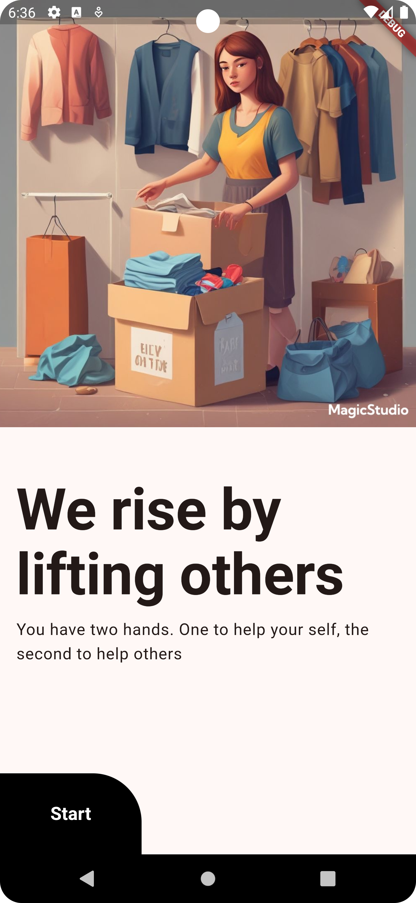
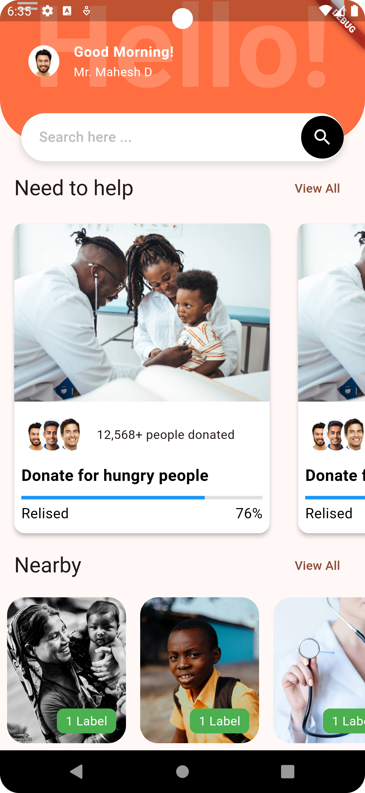
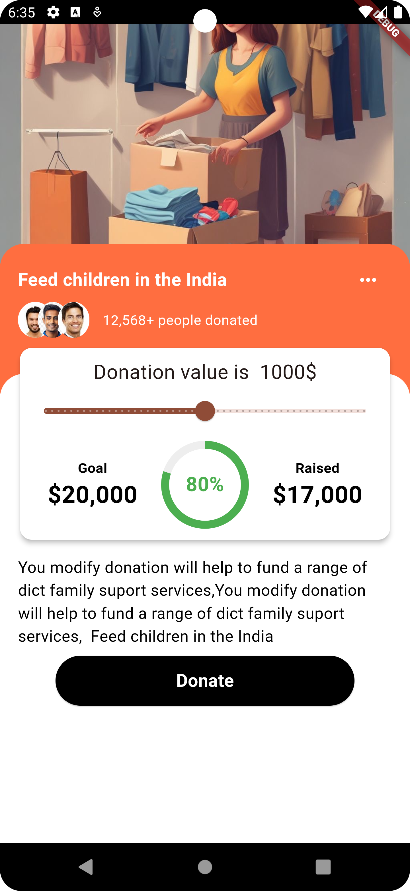

# 📱 Donated - Mobile Donation Platform


## About Donated
**Donated** is a mobile application that simplifies the process of supporting charitable organizations. With this app, users can quickly find, donate, and keep track of various donation campaigns, ensuring their contributions are making a difference. It’s designed to increase transparency and trust between donors and charitable organizations.

The app provides users with the ability to see how much money has been raised for each campaign, the donation progress, and detailed information about the organizations involved.

## ✨ Key Features
- **Browse Donations**: Explore a wide array of donation campaigns from trusted organizations.
- **Quick Donation**: Seamlessly donate to causes you care about using a secure payment flow.
- **Track Progress**: Get real-time updates on the donation goals, amounts raised, and progress percentages.
- **Organization Details**: Access in-depth information about organizations, including their missions and how funds are utilized.
- **Nearby Campaigns**: Discover campaigns in your vicinity to support local initiatives.
- **Personalized Dashboard**: Users can monitor their donation history and save their favorite organizations for future donations.

## 🛠️ Tech Stack
- **Frontend**: Flutter (Dart)
- **Backend**: Firebase / Google Cloud (for data storage and authentication)
- **Design**: Figma (UI/UX Design)
- **APIs**: Payment gateway integration (e.g., Stripe, Razorpay)

## 🚀 Getting Started

### Prerequisites
Before you begin, ensure you have the following installed:
- [Flutter SDK](https://flutter.dev/docs/get-started/install)
- Android Studio or Visual Studio Code
- Firebase account setup
- Payment gateway API keys (e.g., Stripe or Razorpay)

### Installation

1. **Clone the Repository**:
    ```bash
    git clone https://github.com/mahesh1071997/Dontae_app.git
    cd donated
    ```

2. **Install Dependencies**:
    ```bash
    flutter pub get
    ```

3. **Set Up Firebase**:
    - Go to [Firebase Console](https://console.firebase.google.com/).
    - Create a Firebase project and download the `google-services.json` file.
    - Place the `google-services.json` file in the `android/app` directory.
    - For iOS, download `GoogleService-Info.plist` and place it in the `ios/Runner` directory.

4. **Configure API Keys**:
    - Update the `lib/config/payment_config.dart` file with your payment gateway credentials.

5. **Run the App**:
    ```bash
    flutter run
    ```

## 🖼️ Screenshots
| Welcome Screen | Home Page | Donation Campaign |
|:--------------:|:---------:|:-----------------:|
|  |  |  |

## 🤝 Contributing
We welcome contributions to make **Donated** even better!

1. Fork the project repository.
2. Create a new branch for your feature:
    ```bash
    git checkout -b feature/new-feature
    ```
3. Make your changes and commit:
    ```bash
    git commit -m "Added new feature"
    ```
4. Push to your branch:
    ```bash
    git push origin feature/new-feature
    ```
5. Open a Pull Request.

## 🛡️ License
This project is licensed under the MIT License. See the [LICENSE](LICENSE) file for details.

## 💬 Contact
For questions, feedback, or collaboration opportunities, reach out to:

- **Mahesh Dabhi**
  - [LinkedIn](https://www.linkedin.com/in/maheshdabhi)
  - [GitHub](https://github.com/mahesh1071997/)

---

Thank you for checking out **Donated**! Together, we can make a difference. 🌍🤝
